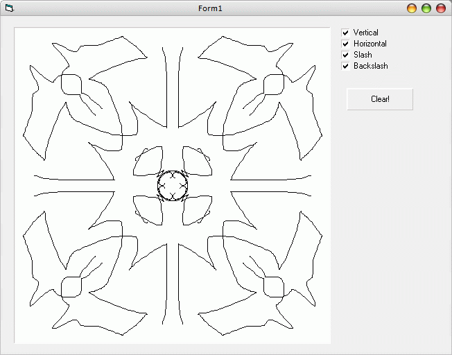

## Mirror Paint

### Description

After seeing the cool "mirror brush" effect in MacPaint 2.0, I decided to emulate the effect in VB to see if I can do it. ;) The program will "mirror" your drawing on the other side of the canvas, so it'll have a reversed symmetrical image.
 
### More Info
 

             |
---                |---
**Submitted On**   |2006-02-27 07:00:02
**By**             |[Remerico Cruz](https://github.com/Planet-Source-Code/PSCIndex/blob/master/ByAuthor/remerico-cruz.md)
**Level**          |Intermediate
**User Rating**    |4.8 (24 globes from 5 users)
**Compatibility**  |VB 5\.0, VB 6\.0
**Category**       |[Graphics](https://github.com/Planet-Source-Code/PSCIndex/blob/master/ByCategory/graphics__1-46.md)
**World**          |[Visual Basic](https://github.com/Planet-Source-Code/PSCIndex/blob/master/ByWorld/visual-basic.md)
**Archive File**   |[Mirror\_Pai1976582272006\.zip](https://github.com/Planet-Source-Code/remerico-cruz-mirror-paint__1-64465/archive/master.zip)

